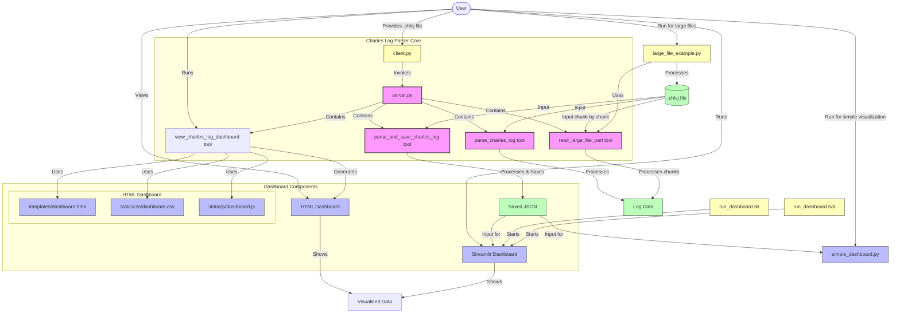
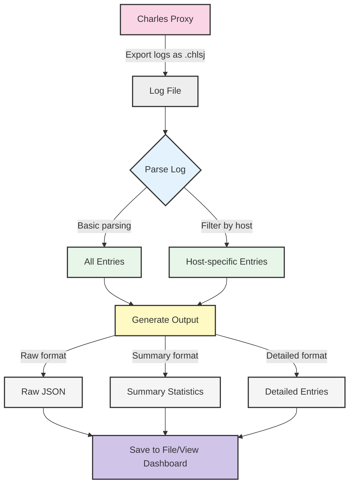

# Charles Log Parser Project Flow Diagram

# Simplified Flow Diagram

For a simpler understanding of the project workflow:

## Project Components Explanation

### Core Components
- **server.py**: MCP server implementing the parser tools
- **client.py**: Client interface for users to parse Charles log files
- **parse_charles_log**: Tool to parse a log file and return data
- **parse_and_save_charles_log**: Tool to parse a log file and save results
- **read_large_file_part**: Tool to process large files in chunks
- **view_charles_log_dashboard**: Tool to visualize parsed data in HTML dashboard

### Dashboard Components
- **HTML Dashboard**: Generated by view_charles_log_dashboard tool
  - **dashboard.html**: HTML template for the dashboard
  - **dashboard.css**: Styling for the dashboard
  - **dashboard.js**: Interactive charts using Chart.js
- **Streamlit Dashboard**: Interactive Python-based dashboard
  - **dashboard.py**: Streamlit app for data visualization
  - **run_dashboard.sh/.bat**: Scripts to launch the Streamlit dashboard

### Data Flow
1. User provides a Charles log file (.chlsj)
2. File is parsed using MCP tools (parse_charles_log or parse_and_save_charles_log)
3. Results are either:
   - Returned directly as JSON data
   - Saved to a JSON file in the output directory
4. Visualization options:
   - HTML Dashboard: Opens directly in browser with interactive charts
   - Streamlit Dashboard: User runs script for advanced data exploration
   - Simple Dashboard: Alternative lightweight HTML visualization

### Alternative Flows
- **Large File Processing**: For very large log files, using large_file_example.py 
  for chunk-by-chunk processing
- **Simple Dashboard**: For environments with limited dependencies 