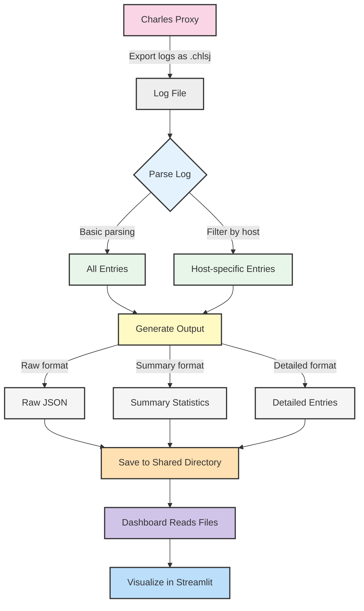

# Charles Log Parser Project Flow Diagram

```mermaid
graph TD
    %% Main components and flows
    User([User]) -->|Provides .chlsj file| Parser
    User -->|Views| Dashboard
    
    %% Core components with separation
    subgraph "mcp-charles"
        Parser[Parser Tools] -->|Process data| LogData[Parsed Data]
        LogData -->|Save to shared dir| SharedOutput[Shared Output]
    end
    
    subgraph "mcp-charles-shared"
        SharedOutput -->|JSON files| SharedDir[/output/ dir]
    end
    
    subgraph "mcp-charles-dashboard"
        SharedDir -->|Read JSON| Dashboard[Dashboard]
    end
    
    %% Parser tools
    Parser -->|Basic parse| Basic[parse_charles_log]
    Parser -->|Save results| Save[parse_and_save_charles_log]
    Parser -->|Large files| Large[read_large_file_part]
    Parser -->|Filter by host| Filter[parse_by_host]
    
    %% Output options
    Dashboard -->|Streamlit| StreamView[Interactive View]
    
    %% Output formats
    LogData -->|Raw| RawJSON[Raw JSON]
    LogData -->|Summary| SummaryStats[Statistics]
    LogData -->|Detailed| DetailedView[Detailed Data]
    
    %% Styling
    classDef core fill:#f9f,stroke:#333,stroke-width:2px;
    classDef shared fill:#ffc,stroke:#333,stroke-width:2px;
    classDef dashboard fill:#bbf,stroke:#333,stroke-width:1px;
    classDef tool fill:#bfb,stroke:#333,stroke-width:1px;
    
    class Parser,LogData core;
    class SharedOutput,SharedDir shared;
    class Dashboard,StreamView dashboard;
    class Basic,Save,Large,Filter tool;
```

# Simplified Flow Diagram

For a simpler understanding of the project workflow:



## Project Components Explanation

### Component Separation
The project is now divided into three separate components:
- **mcp-charles**: Contains the parser functionality
- **mcp-charles-dashboard**: Contains the dashboard visualization
- **mcp-charles-shared**: Shared directory for communication between components

### mcp-charles (Parser Component)
- **server.py**: MCP server implementing the parser tools
- **client.py**: Client interface for users to parse Charles log files
- **parse_charles_log**: Tool to parse a log file and return data
- **parse_and_save_charles_log**: Tool to parse and save results to the shared directory
- **large_file_example.py**: Script to process large files in chunks

### mcp-charles-shared (Shared Directory)
- **output/**: Directory where parsed JSON files are stored
- Used for communication between the parser and dashboard components

### mcp-charles-dashboard (Dashboard Component)
- **dashboard.py**: Streamlit app for data visualization
- **run_dashboard.sh/.bat**: Scripts to launch the Streamlit dashboard
- **requirements.txt**: Dashboard-specific dependencies

### Data Flow
1. User provides a Charles log file (.chlsj)
2. File is parsed using MCP tools in the mcp-charles component
3. Results are saved to the shared directory (mcp-charles-shared/output)
4. User runs the dashboard from the mcp-charles-dashboard component
5. Dashboard reads parsed files from the shared directory
6. Dashboard visualizes the data using Streamlit

### Alternative Flows
- **Large File Processing**: For very large log files, using large_file_example.py in the mcp-charles component for chunk-by-chunk processing
- **Direct API Usage**: Clients can use the MCP API directly for custom integrations 